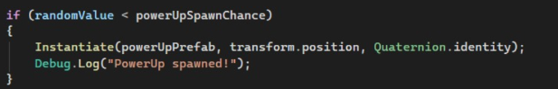

# Mujeres Creando Videojuegos
Proyectos base para la certificación "Mujeres Creando Videojuegos"

## Descripción
Hola! Bienvenida al repositorio de los proyectos que estaremos realizando en la certificación, y de paso si quieres ver otros proyectos que he hecho puedes verlos [aquí](https://github.com/FernandezDL)

Como en la certificación vamos a trabajar un proyecto 2D y un 3D vamos a crear una rama para cada uno de ellos, y en cada rama solo va a estar el código base que hagamos en clase.

>[!WARNING]
>A pesar de que yo les esté dando el código base no quisiera que descargaran el proyecto como tal y lo usaran sin entender qué está pasando. Tómenlo como una guía y hagan el proyecto algo propio

## Breakout - 2D
Felicidades! Ya crearon su primer videojuego en 2D con _Unity Engine_

_**Breakout**_ es un juego donde el jugador controla una paleta que rebota una pelota para destruir bloques. El objetivo es eliminar todos los bloques sin dejar que la pelota caiga.

### Recordando: 
Con este juego aprendimos que en Unity todo está basado en objetos y componentes. Todos las partes del juego son objetos y todos tienen diferentes comportamientos.

#### Simulación de física
Como vimos en la primera sesión, Unity es un motor de juegos que simula físicas de la vida cotidiana, y en este caso usamos el sistema de físicas para:
- Hacer que la pelota se mueva
- Detectar colisiones entre objetos
- Rebotar la pelota contra paredes, bloques y la paleta

Diferenciando entre:
- Colisiones físicas (interacción real)
- Triggers (detección sin interacción física)

#### Movimiento del jugador
Implementamos el movimiento de la paleta usando el teclado, permitiendo al jugador moverse horizontalmente dentro de los límites del juego. También se implementó la congelación del movimiento en el eje Y y la rotación del jugador para evitar comportamientos extraños.

#### Interacción con bloques
Cada vez que la pelota golpea un bloque:
- El bloque se destruye
- Se actualiza el puntaje del jugador
- Se genera un número random para generar un power up dependiendo de la probabilidad de que se aparición

#### Lógica del juego
Agregamos un sistema básico de lógica que controla:
- El puntaje del jugador
- La condición de victoria (cuando ya no quedan bloques)
- La condición de derrota (cuando la pelota toca el suelo)

#### Power Ups
Estos son objetos que aparecen al destruir un bloque, según probabilidad, y modifican el comportamiento del juego. Este nuevo concepto permitió:
- Creación dinámica de objetos
- Detección de interacciones
- Modificación de propiedades en tiempo real

### Tarea
>[!NOTE]
>La tarea de este módulo se debe entregar antes del 1 de mayo a las 23:59.

Para la tarea se debe:
#### Preparación
Aumenta la cantidad de bloques en la pantalla, pueden tener el mismo color o cambiarlos dependiendo de las filas.

#### Powerup de reducción
1. Crea el script "ShrinkPowerUp.cs"
2. Hacer que el powerup caiga
3. Crear el sprite y asignar color distinguible. Crear Prefab
4. Hacer que la paleta se encoja al detectar el powerup
5. En el script de "BlockCollision.cs" modificar la parte de la generación del power up:
    - Generar otro valor random
    - Si el valor es menor a 0.3 instanciar el Powerup de crecimiento
    - Si el valor está entre 0.3 y 0.6 instanciar el Powerup de reducción
    - Si el valor es mayor a 0.6 instanciar un Powerup propio

#### Powerup propio
¡Es momento de crear un nuevo powerup! 

Crear un powerup con una funcionalidad diferente a los dos anteriores. Puedes hacer el powerup que quieras pero te dejo algunos ejemplos:

- Agrandar la pelota
- Encoger la pelota
- Aumentar la velocidad de la pelota
- Disminuir la velocidad de la pelota
- Aumentar el score de cada bloque
- Cambiar el color de la paleta
- Cambiar el color de la pelota

#### Entegar
Grabar un video donde se muestren todas las funcionalidades hechas:
- Movimiento en X de la paleta
- Movimiento y rebote de la pelota
- Rebote en las paredes y en el techo
- Condición de victoria: Imprimir mensaje en consola al eliminar todos los bloques
- Condición de derrota: Imprimir mensaje en consola cuando la pelota toque el piso
- PowerUp de crecimiento (hecho en clase): Que agrande la paleta en el eje X
- PowerUp de reducción: Que reduzca la escala de la pelota en el eje X
- PowerUp propio: Funcionalidad a escoger.

Subir código del proyecto:
- Comprimir la carpeta en un archivo ZIP y entregarlo, si la carpeta es muy pesada para entregar el código se puede eliminar la carpeta 'library' del proyecto.

#### Aspectos a calificar
- Código sin errores - 5%
- Aspect ratio de la pantalla: Full HD - 5%
- Distinción visual (diferentes colores) entre todos los elementos - 5%
- Orden y limpieza en la escena y en la carpeta del proyecto - 10%
- Funcionalidades hechas en clase completas (Movimientos, límites del mundo, rotación y movimiento congelados, etc) - 25%
- Funcionalidades de la tarea completas - 40%
- Entrega del video - 5%
- Entrega del código - 5%